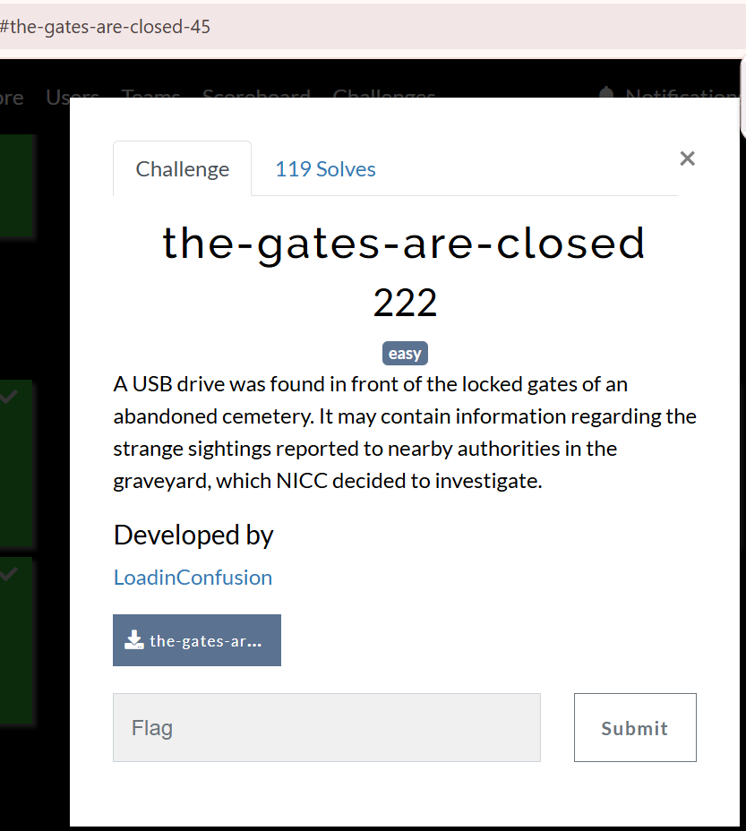
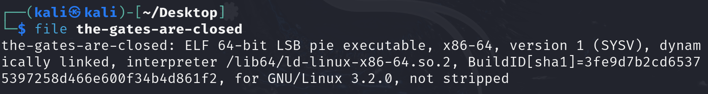
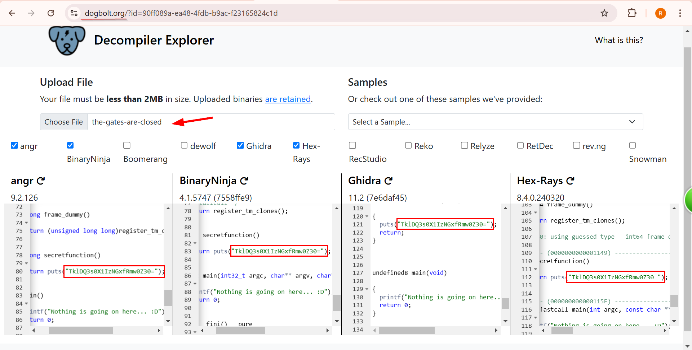
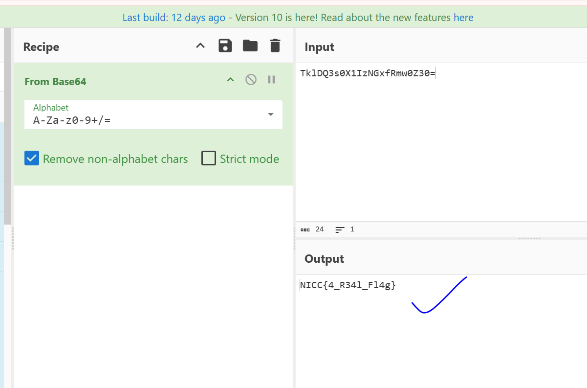

### Challenge description
Here is the challenge description:

And we were given the unknown file named as the gates-are-closed.

### Solution

i used the **file** command in my linux to know the type of file.

I came to know that it is **ELF 64-bit LSB pie executable, x86-64,** , to decompiled it , i threw it into the online decompiler. 

Then i copy pasted this string into the cyber chef and found the flag.

