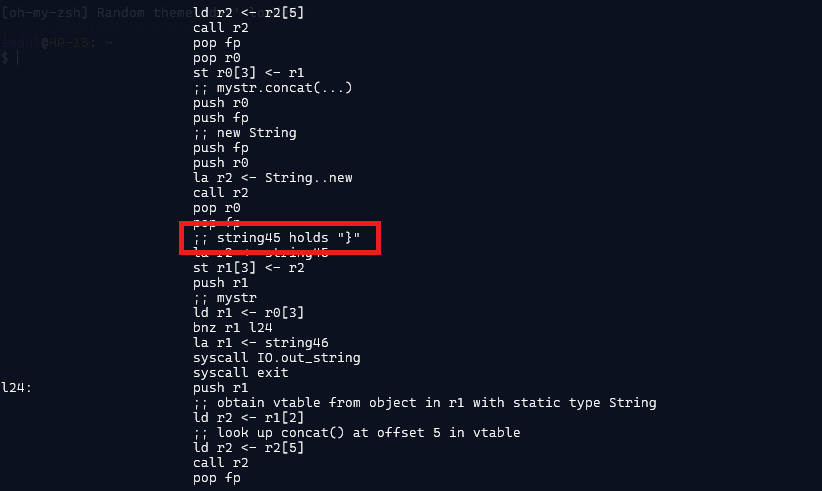

### Challenge description

As Mary was attempting to time travel, she slipped on a patch of ice and landed on her butt. While getting up from the ice, she found a cool-looking USB flash drive containing a file with some system code. Can you help Mary decrypt what information the file has?

### Solution

We were provided a file `freezingprogram.txt` that contains assembly instructions. Looking at the instructions, there are some comments that contains interesting data:

There are many strings like these scattered throughout the code. It seems like they contain the flag. So now we have to find a way to grep these strings only to see if it conatins the flag.
Strings are formatted like: `string8 holds "N"` and so on. Using grep, we can extract only these strings from the code: `grep -E 'string[0-9]+ holds ".+"' freezingprogram.txt`

And here is our flag. `NICC{hEy_th1s_is_Co0L}`