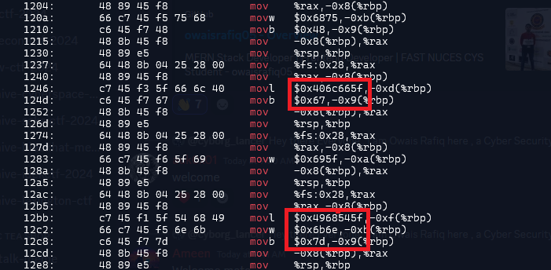

### Challenge description

NICC recieved a mysterious email with an executable file that does nothing. Can you figure out what this executable does?

### Solution

We were provided an executable `some-random-file` that does nothing. Disassembling the file reveals some interesting data. Some hex values were getting stored using `mov` instructions. simply disassemble and grep `mov` opcode to filter these values:

`objdump -d some-random-file  | grep mov`

Taking these values and decoding hex gives us the flag. We also have to swap endianness.

`NICC{uhH_fl@g_i_ThInk}`