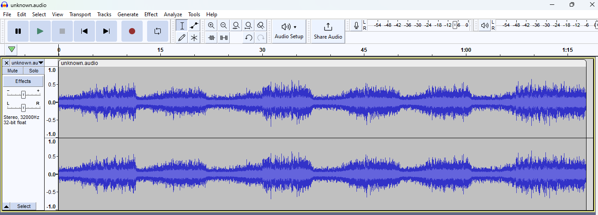
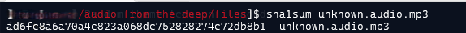
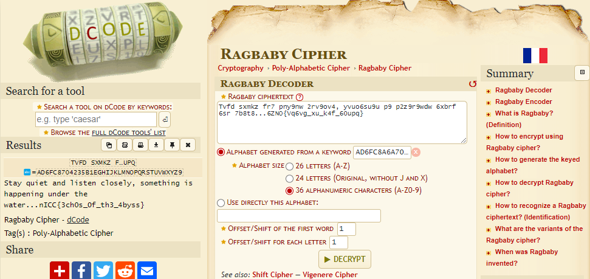

### Challenge description

The Zorglax shared this weird audio they captured while scanning the various bodies of water on Earth. NAH caught wind of this and decided to share the files with NICC just in case they were interested in finding out more. The static-sounding screams in the audio might have a connection with the rise of supernatural activity...

### Solution

> Note: We did not manage to solve this challenge during CTF. It was solved later by taking a hint.

We were provided two files: `strange.report.txt` and `unknown.audio.mp3`. The contents of strange-report files seems to be encrypted data, probably our flag `Tvfd sxmkz fr7 pny9nw 2rv9ov4, yvuo6su9u p9 p2z9r9wdw 6xbrf 6sr 7b8t8...6ZNO{Vq6vg_xu_k4f_60upq}`.

The unknown-audio was a 56 seconds long audio file which contains some random noise. Analyzing audio file in Audacity did not reveal any useful information just a simple multi-stereo audio.

Later during the challenge, they revealed two hints.

> Hint 1: `Audio file is the key`
> Hint 2: `The key is 20 bytes long`

As the SHA-1 hash is also 20 bytes long, the first instinct was that the SHA-1 hash of audio file is the key. So we calculated the SHA-1 hash of the audio file.

We tried different decryption algorithms but didn't find the correct one. Besides, it was just a guess that SHA-1 hash could be the key, so we decided to leave this method. Only to later find out that it was a **Ragbaby Cipher**. We can use [dcode.fr](https://www.dcode.fr/ragbaby-cipher) to decrypt our message using sha1sum as a key.

And we got the flag. `nICC{3ch0s_0f_th3_4byss}`