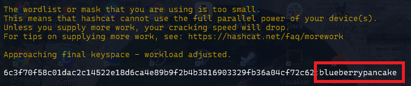

### Challenge description

NICC is on the hunt for the elusive moth-man! In order to draw him out of hiding, we need to cook a nice breakfast for him. Luckily, one of our agents has recovered a hash of the cryptid's favorite breakfast. Crack the hash and serve up a great breakfast!

NICC{breakfast_item}

### Solution

We were `hash.txt` file containing a hash: `6c3f70f58c01dac2c14522e18d6ca4e89b9f2b4b3516903329fb36a04cf72c62` and a `wordList.txt` file with possible passwords. Any tool can be used to crack the hash from here. Here is the command for `hashcat`:

> hashcat -m 1400 -a 0 hash.txt wordList.txt

Where 1400 is for cracking sha256 hash. 

Here is our flag. `NICC{blueberrypancake}` (The hash could also be cracked using [CrackStation](https://crackstation.net/))

