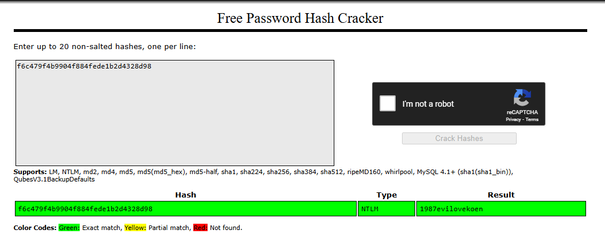

### Challenge description

Anna Circoh has intercepted a highly sensitive memory dump, but The Consortium has fortified it with advanced encryption, hiding their deepest secrets within. Participants must analyze the data and navigate through layers of defenses to find a key piece of information we are thinking its a leaked password. Dr. Tom Lei has rigged the memory with decoys and traps, so tread carefully—one wrong step could lead you down a path of misdirection.

*Some AV's may detect the attachment as malicious. This is a false positive and can be ignored*


### Solution

We were given a lsa minidump file for the challenge. There is a great article regarding analyzing these files [here](https://medium.com/@offsecdeer/dumping-lsass-remotely-from-linux-efc47391e56d). We can use [pypykatz](https://github.com/skelsec/pypykatz) which is the Python implementation of Mimikatz and can be used for parsing the secrets hidden in the LSASS process. By simply providing the file to `pypykatz` using the command: `pypykatz lsa minidump dump.DMP`, we saw some interesting data:

> First few lines of output
```
== LogonSession ==
authentication_id 6471305 (62be89)
session_id 2
username Consortium
domainname DESKTOP-UBFFHS2
logon_server DESKTOP-UBFFHS2
logon_time 2024-10-18T01:40:41.720992+00:00
sid S-1-5-21-996221637-1914836208-3740248221-1011
luid 6471305
        == MSV ==
                Username: Consortium
                Domain: DESKTOP-UBFFHS2
                LM: NA
                NT: f6c479f4b9904f884fede1b2d4328d98
                SHA1: 8e0cf85ff4c266ff4ef626580cce1ff025118c6f
                DPAPI: 8e0cf85ff4c266ff4ef626580cce1ff0
        == WDIGEST [62be89]==
                username Consortium
                domainname DESKTOP-UBFFHS2
                password None
                password (hex)
        == Kerberos ==
                Username: Consortium
                Domain: DESKTOP-UBFFHS2
        == WDIGEST [62be89]==
                username Consortium
                domainname DESKTOP-UBFFHS2
                password None
                password (hex)
```

We found the password hashes for 3 users. But looking at the description, Consortium user seems interesting. We tried to crack the user hash using `CrackStation`. and the NTLM hash gave us the results:



And here is our flag! By simply wrapping this in NICC{}, we got our valid flag. `NICC{1987evilovekoen}` 