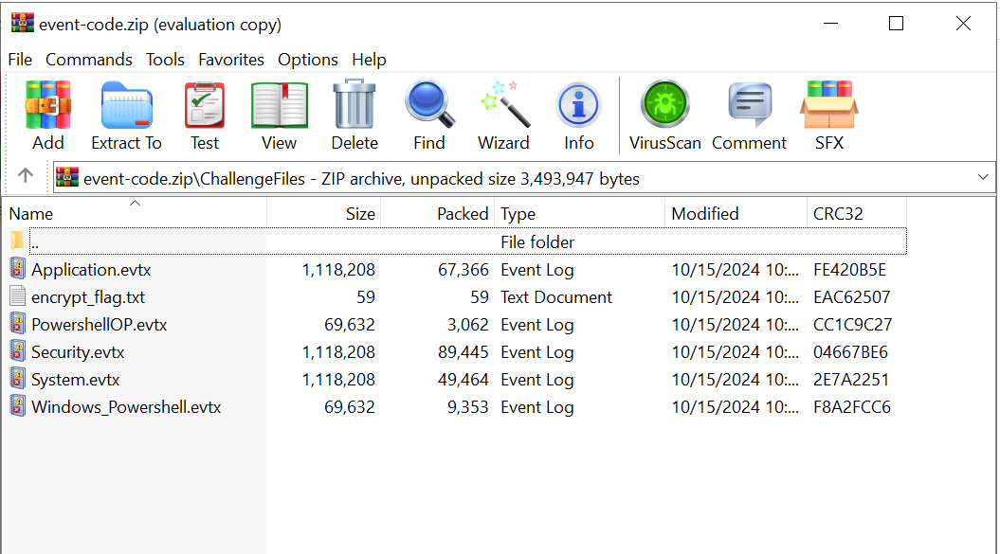
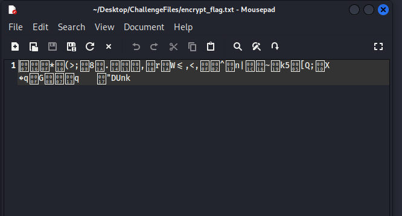
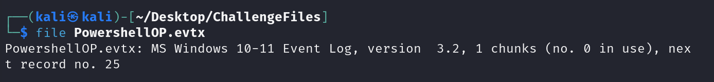
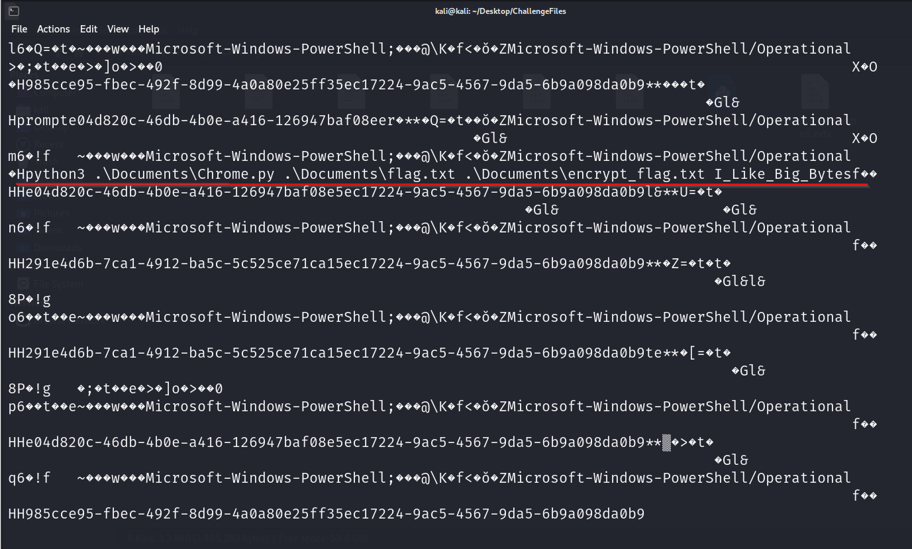
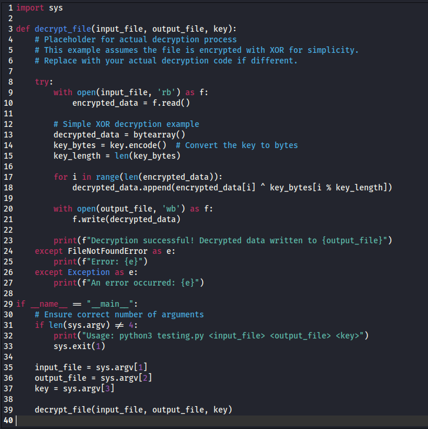
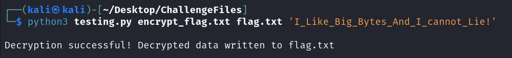
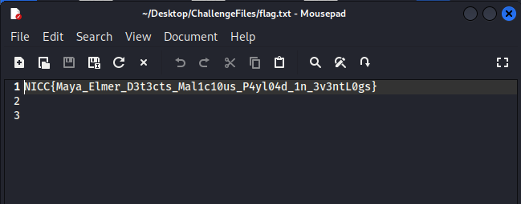

### Challenge description


### Solution
Here. We are given with the zip file which has 5 event log files and 1 text file.

 

Seeing the contents of the text file. 



It seems like some kind of binary data or binary strings. 

Examining the files one by one.



when i displayed the contents of the file by using the command `cat PowershellOP.evtx` I saw these lines:



which were something like these

sys.argv[2]`n    key = sys.argv[3]`n`n    with open(input_file, 'rb') as f:`n        i�Gl&_data = f.read()`n`n    result_data = process_data(input_data, key)`n`n 	 
import sys`n`ndef process_data(input_bytes, key):`n    key_bytes = key.encode('utf-8')6
Documents\Chrome.py .\Documents\flag.txt .\Documents\encrypt_flag.txt I_Like_Big_Bytes_And_I_cannot_Lie!6f2352a0-5370-44b5-9fae-5cb96070ed74

then i made a python script to decrypt the lines present in encrypt_flag.txt using __I_Like_Big_Bytes_And_I_cannot_Lie!__ as a key.

<!---->

```python
import sys

def decrypt_file(input_file, output_file, key):
    # Placeholder for actual decryption process
    # This example assumes the file is encrypted with XOR for simplicity.
    # Replace with your actual decryption code if different.
    
    try:
        with open(input_file, 'rb') as f:
            encrypted_data = f.read()
        
        # Simple XOR decryption example
        decrypted_data = bytearray()
        key_bytes = key.encode()  # Convert the key to bytes
        key_length = len(key_bytes)
        
        for i in range(len(encrypted_data)):
            decrypted_data.append(encrypted_data[i] ^ key_bytes[i % key_length])

        with open(output_file, 'wb') as f:
            f.write(decrypted_data)
        
        print(f"Decryption successful! Decrypted data written to {output_file}")
    except FileNotFoundError as e:
        print(f"Error: {e}")
    except Exception as e:
        print(f"An error occurred: {e}")

if __name__ == "__main__":
    # Ensure correct number of arguments
    if len(sys.argv) != 4:
        print("Usage: python3 testing.py <input_file> <output_file> <key>")
        sys.exit(1)
    
    input_file = sys.argv[1]
    output_file = sys.argv[2]
    key = sys.argv[3]

    decrypt_file(input_file, output_file, key)
```

now after running the python script here i got the flag:

 

  
