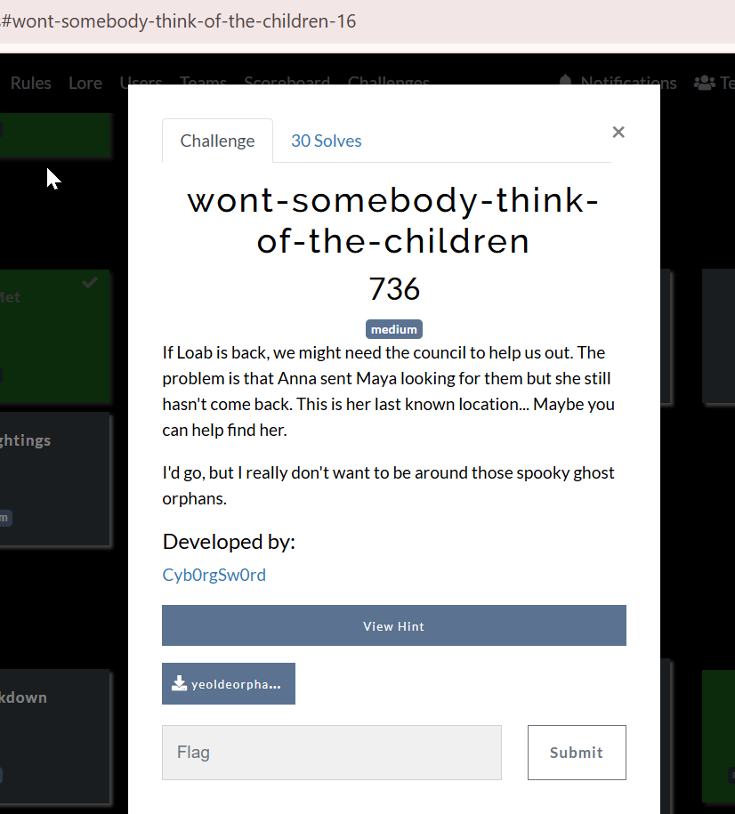
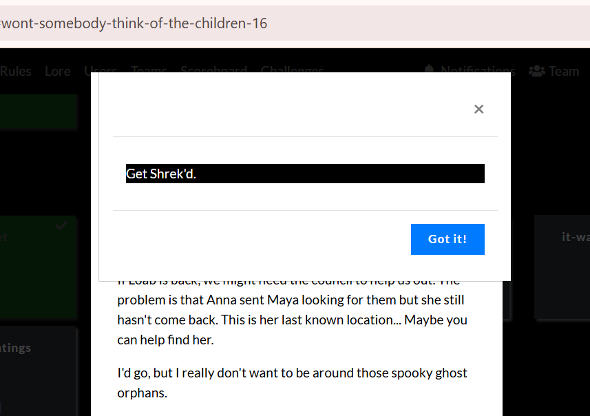
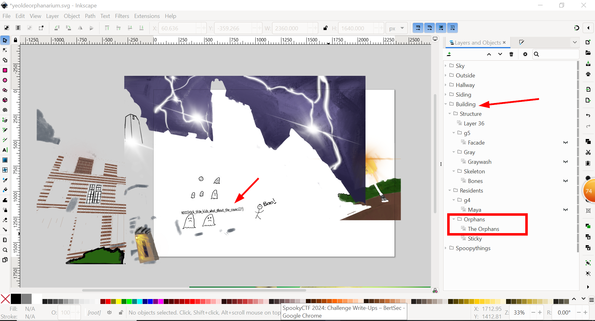

### Challenge description

Here is the challenge description:

### Challenge picture

Here is the hint:

### Solution

In the challenge we were given by the .svg(Scalable Vector Graphics) image. I opened the .svg file in the inkspace. and then started to hide unhide the layers of the .svg file.

and after this i found the flag under the building category.

