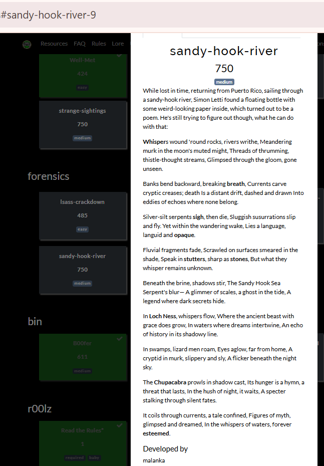
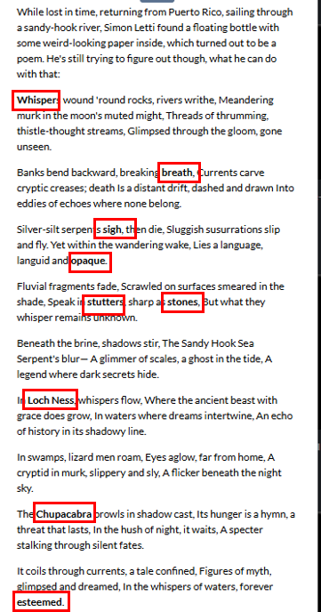
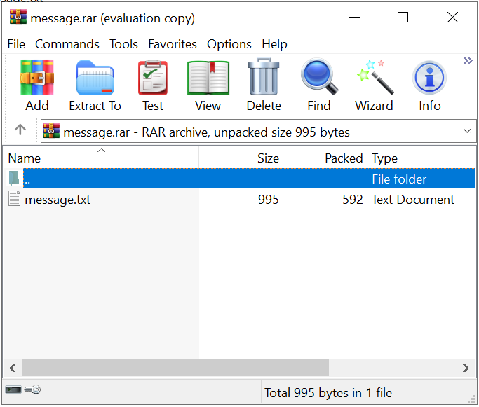
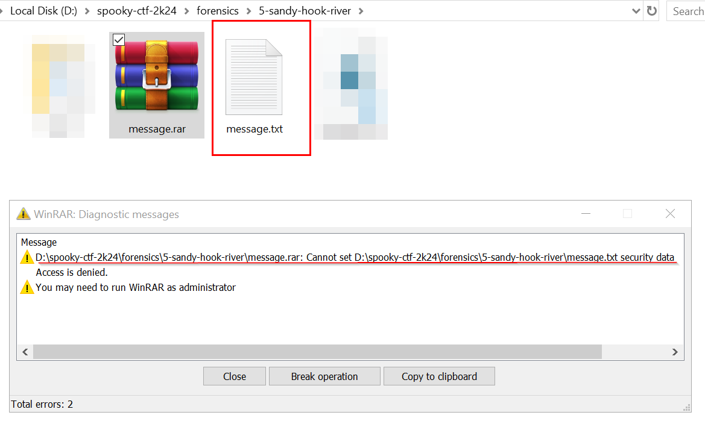
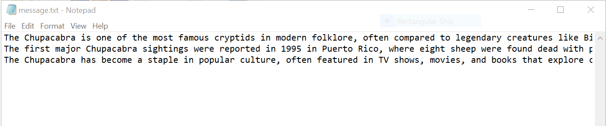
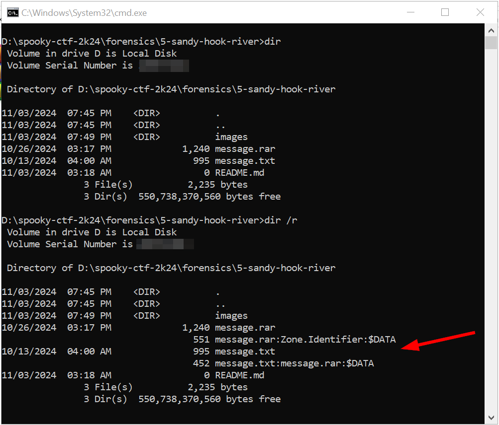
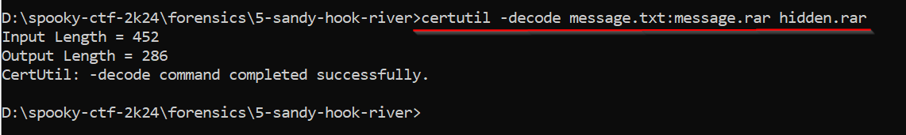
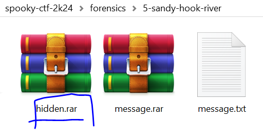
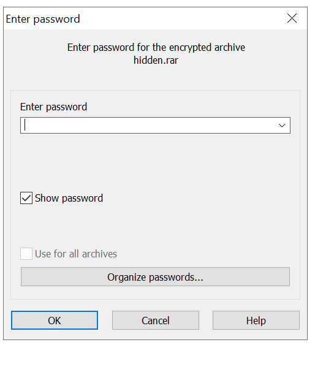
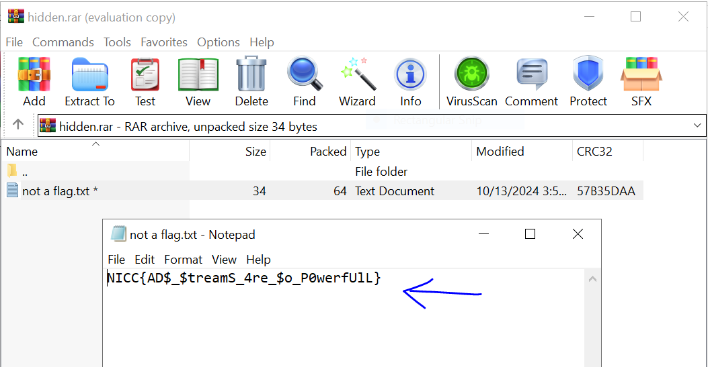

### Challenge description

Here is the challenge description:

 

And we were given the message.rar file.

### Solution
When i read the description of the challenge carefully i extracted some words from it which were bold written in the paragraphs.

 

which turned out to be a : **WhisperbreathsighopaquestuttersstonesLoch NessChupacabraesteemed**

Now moving forward, 

When i opened the rar file manually, it just contained the message.txt:

 

When extracting the rar file i faced this issue although the message.txt file was extracted:

 

The message.txt file does not contain any useful information:
 

i used the command **dir** to lists the contents of a directory, showing files and folders along with some basic details like file size, date modified, etc., then i used the **dir /r** command to lists the contents of a directory, and it also includes additional information specifically for Alternate Data Streams (ADS) on files, which is a feature of the NTFS file system. ADS allows files to contain hidden metadata or other "streams" of data that are not typically visible. When we use **dir /r**, we see these hidden streams if they exist.

 

Now i used the command 
**certutil -decode message.txt:message.rar hidden.rar**
to extract and decode an Alternate Data Stream (ADS) named message.rar that is hidden within the file message.txt. By decoding it into hidden.rar, We can create an accessible, separate file (hidden.rar) from the hidden ADS data. 

 

Here we got the hidden.rar file:

 

but it is password protected .

 

Now entering the string which we extracted from the bold words of the challenge description 
i.e :**WhisperbreathsighopaquestuttersstonesLoch NessChupacabraesteemed**

here we got the final flag:
 
