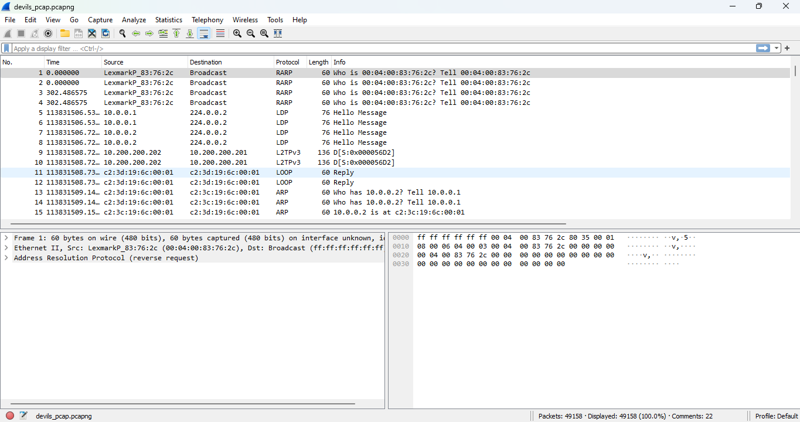
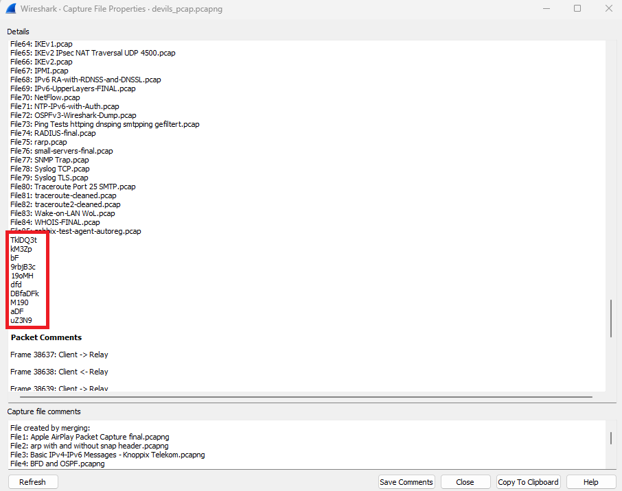
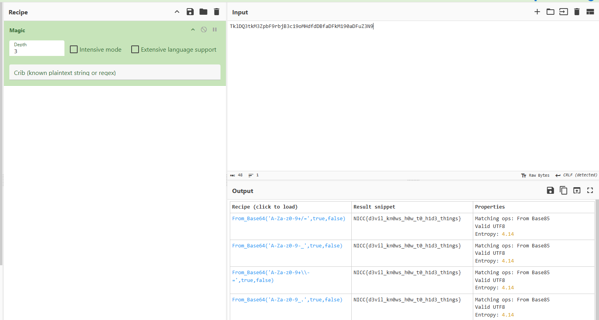

### Challenge description

On his way back from a Sandy Hook River, Simon Letti discovered that the stash didn't only contain some piece of information but the evidence of the Consortium performing some bad things. There was another thing that he managed to retrieve from the stash, and it had so much information in it that he can't figure out what piece of information is hidden exactly. But because of his experience, something comes to his mind—that this is something easy. Help Simmon Letti find the true information.

> With this description, we were provided with a packet capture file: `devils_pcap.pcapng`

### Solution

The first look at the challenge revealed that its a very large file with around 50,000 packets.

There was a lot of interesting data in the file. Many packets were pointing to `ip.webernetz.net` so it looked interesting at first but it was just a rabbit hole. After trying everything, we couldn't find the flag in any of the packets.

Spending some time, we realized that we forgot to check the `Capture File Properties` in Wireshark. To our luck, that's exactly where the flag was hidden!
In Wireshark, go to Statistics > Capture File Properties. This opens up a new window with capture properties like Stats, Comments, Time, etc. We can also edit and add custom data in these Properties while making a capture file (Which was done in this challenge). By going at the bottom of properties, we found something interesting:

The highlighted data looks like some encoded value. So by pasting it in [CyberChef](https://gchq.github.io/CyberChef) and using magic recepie, we found our flag.

