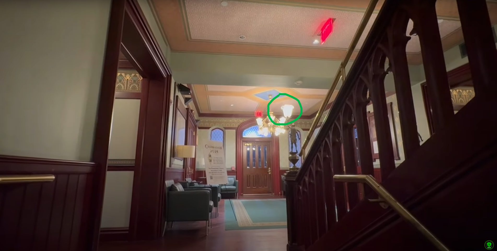
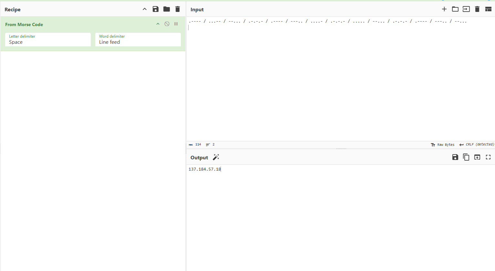
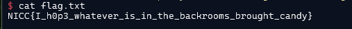

### Challenge description

NICC agents were sent this video by an anonymous source. What does it mean?!

**Warning:** The video is very spooky.

### Solution

We were provided with [this](https://www.youtube.com/watch?v=4Xv8pLoDVP0) YouTube video.

The video had random things most of which were meaningless. Although at the beginning of video, some words flashes: **COME GET YOUR FILE**. We tried wrapping it in flag tags `NICC{COME_GET_YOUR_FILE}` but it wasn't the flag. So moving forward, at the end of the video, there was something interesting.

The video was capturing a blinking lamp:

At first glance, it seems like a morse code. 

So now we have to read the morse code from the blinking light. [Here](https://www.youtube.com/watch?v=i3HOGdQkTvM) is the great explanation of how to do it. 
[Here](https://morsecode.world/international/morse2.html) is the explanation table of how to do it.
 
In short, when light blinks for one second, it is considered a dot `.` and for 3 second blink, it is considered a dash `-` . If it stays off for 3 seconds it means that the new character is starting. Following the same pattern we extracted this morse code:

`.---- / ...-- / --... / .-.-.- / .---- / ---.. / ....- / .-.-.- / ..... / --... / .-.-.- / .---- / ---.. / --...`

Decoding this morse code we got the value: `137.184.57.18` which seems like an ip address. 

Running Nmap revealed that ftp is running on port 21. And the ftp Anonymous login was enabled. After logging into ftp: `ftp 137.184.57.18` there was a flag.txt file. `get flag.txt` and then read the flag.

