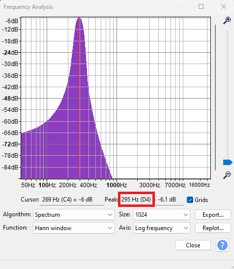
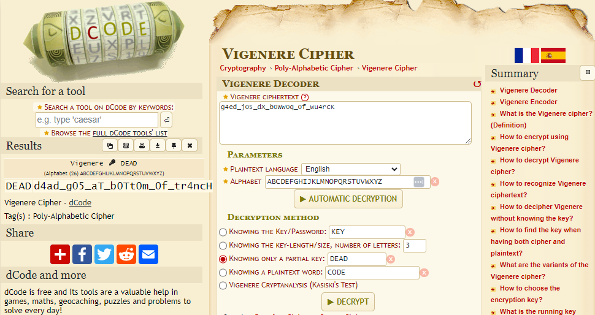

### Challenge description

In 1997, an underwater anomaly was recorded by the NOAA (National Ocean and Atmospheric Administration). No explanation for the sound could be given at the time, but eventually a widely accepted answer elaborating on glacial movements surfaced. At least, that's what we thought. Recently, in her exploits across time, Mary Morse of NICC has ended up in 1997 to uncover the "truth" as she playfully calls it. Her whereabouts are currently unknown (as always), but a series of tones were presumably sent by her deep beneath the sea. They were recorded, augmented, and kept for years by NOAA staff in addition to the titular bloop. Perhaps she discovered something so foreboding it had to be hidden? We were able to crack the first part - `g4ed_j05_dX_b0Ww0q_0f_wu4rcK`. Looks to be a Vigenere cipher encoded with a key. Your job is to find the key to go with this cipher and break it.

 (After cracking the Vigenere cipher, place it between the curly braces in `NICC{}`!).

### Solution

We were provided 4 `.wav` audio files. Listening to audio and analyzing them in Audacity reveals nothing interesting. So we tried plotting a spectrum and combining all frequncies to see if it makes sense. In Audacity, go to `Analyze` tab and then `Plot Spectrum`. The first audio file gave us frequency of 295 Hz which is equal to D4 on a musical note.

Similarly, the second one gave us 328 Hz which is equal to E4. The third one gave 443 Hz which is A4. And the last one gave 295 Hz which is again D4. Combining their musical notes values, we got potential key: `DEAD`. Let's try it against `Vigenère Cipher`

Here is our flag. `NICC{d4ad_g05_aT_b0Tt0m_0f_tr4ncH}`