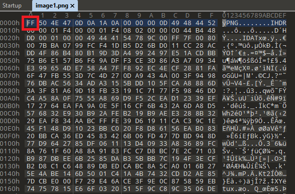
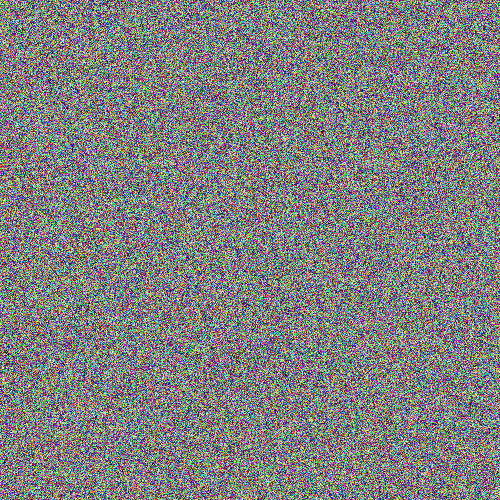
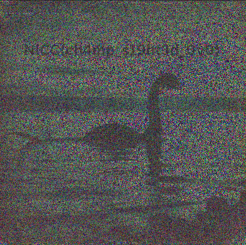

### Challenge description

Lake Champlain has always been a hotspot for mysterious sightings, but it seems like something recently odd came up. Apparently an old cryptid hunter went missing after attempting to reveal his findings. Rumors have been spreading that the cryptid hunter was once affiliated with the Consortium. But anything they left behind? An broken hard drive. Simon was able to recover the hard drive. Unfortunately, he was only able to recover two images files that are corrupted, likely tampered by the Consortium. Anna is tasking you to JOIN Simon piece this puzzle TOGETHER to uncover what the Consortium are hiding.

### Solution

We are given two png images. Both of which are corrupted. The image headers were changed, we can fix it using any hex editor. We used `010 Editor`:

PNG file header starts with 89. [Here](https://en.wikipedia.org/wiki/List_of_file_signatures) is a useful list of file signatures. In the challenge, the first byte was swapped with FF. So changing it fixed our image:

Now we have 2 images that looks like this. So we combined them using [Photopea](https://www.photopea.com/). Moving both images over each other and adjusting some shading gave us the flag.

`NICC{cH4mp_s19ht3d_0v0}`