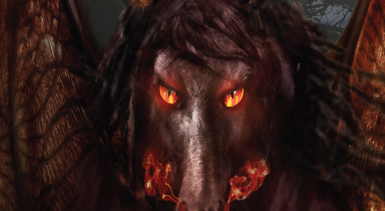
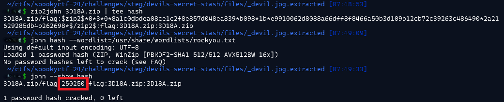

### Challenge description

In the depths of the Pine Barrens, a cryptic legend whispers of the Jersey Devil guarding a picture. Tales speak of forgotten knowledge sealed within, but only those sharp enough to see the truth can unlock its secrets. The key? The key hiding in plain sight, woven into the eerie folklore itself, waiting for the chosen few to discover and reveal the dark treasures within.

### Solution

We have a jpg image `devil.jpg`:

Using binwalk, we can see that there is a hidden zip file in the image. Extract the data using `binwalk -e devil.jpg`. After extracting, we got zip file `3D18A.zip` which is password protected. We can simply use `zip2john` and then `john` to get the password:

Now use this password to extract zip file: `7z e 3D18A.zip`. Then provided the password on prompt and you will get the flag file.

`NICC{J3rS3y_D3v1l_Arch1V3}`