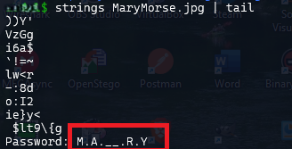

### Challenge description

Mary got a letter from Maya talking about seeing a cryptid sighting but doesn't want other people to know, the only thing attached is this picture? She wonders if there could be a secret message hidden inside.

### Solution

We have a jpg image `MaryMorse.jpg` that seems to contain some data. Checking out strings shows password at the end.

Use steghide to extract the data using this password. `steghide --extract -sf MaryMorse.jpg -xf data`

Extract and read the data:

`NICC{tHe_whIspeRz_iN_Th3_aiR}`